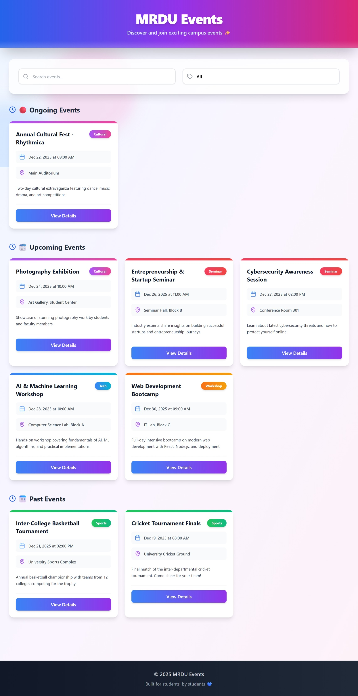
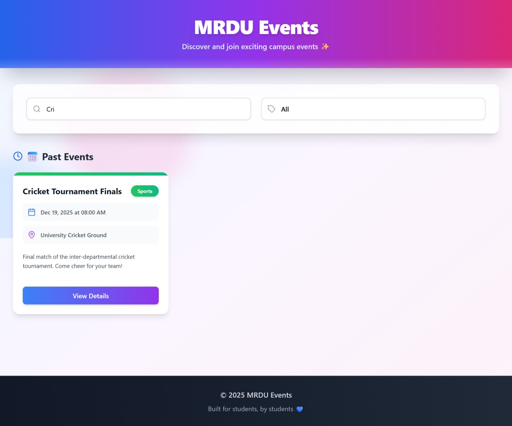
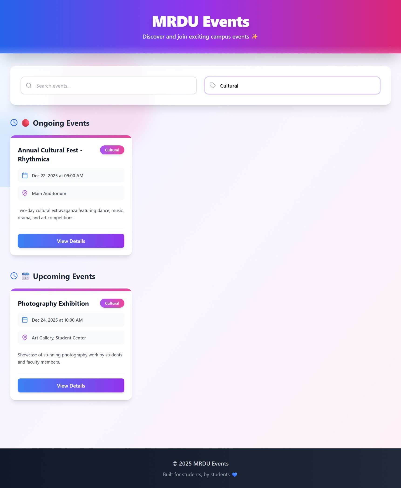

# MRDU Events - College Event Dashboard

A modern, responsive event dashboard for university students to discover and explore campus events.

## Features

- Real-time event search
- Category-based filtering
- Automatic event categorization (Ongoing/Upcoming/Past)
- Responsive design for all devices
- Beautiful gradient UI with animations
- Reusable React components

## Installation

1. Clone the repository
2. Install dependencies:
   ```bash
   npm install
   ```
3. Start the development server:
   ```bash
   npm start
   ```
4. Open [http://localhost:3000](http://localhost:3000) in your browser

##  Project Structure

```
src/
├── components/       # Reusable UI components
├── data/            # Event data
├── styles/          # Global styles
├── App.jsx          # Main application component
└── index.js         # Entry point
```

##  Tech Stack

- React 18
- Tailwind CSS
- Lucide React (icons)
- JavaScript ES6+

##  Adding New Events

Edit `src/data/eventData.js` and add new event objects with the following structure:

```javascript
{
  id: unique_number,
  name: "Event Name",
  date: "YYYY-MM-DDTHH:mm:ss",
  endDate: "YYYY-MM-DDTHH:mm:ss",
  location: "Event Location",
  description: "Event description",
  category: "Tech|Cultural|Sports|Workshop|Seminar"
}
```

##  Future Enhancements

- Backend integration
- User authentication
- Event registration system
- Admin panel for event management
- Calendar view
- Email notifications

##  License

MIT License - Feel free to use this project for your college!
```

---

##  Setup Instructions

1. **Create a new React app** (if starting from scratch):
   ```bash
   cd MRDUEvents
   ```

2. **Install Tailwind CSS**:
   ```bash
   npm install -D tailwindcss postcss autoprefixer
   npx tailwindcss init -p
   ```

3. **Install Lucide React** (for icons):
   ```bash
   npm install lucide-react
   ```

4. **Copy all the files** above into their respective locations

5. **Run the application**:
   ```bash
   npm start
   ```

The app will open at `http://localhost:3000`

---

##  Notes

- All dates in `eventData.js` are set relative to the current date for demo purposes
- You can easily modify the dates to match your actual events
- The styling uses Tailwind CSS utility classes
- The app is fully responsive and works on mobile, tablet, and desktop
- No backend required - all data is stored locally in JavaScript

Enjoy your beautiful event dashboard! 
## Demonstration
Here's how the dashboard looks!


